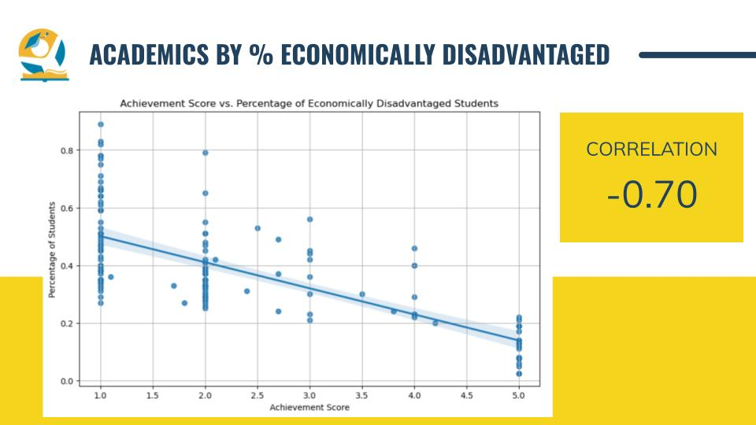
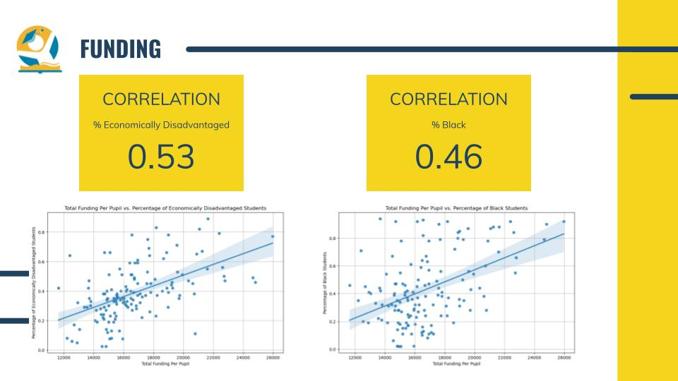

# Bridging the Gap: Analyzing Equity in Metro Nashville Public Schools

## Motivation
I've been a teacher at a Title 1 MNPS school for six years. My experience gives me insight into both the strengths and weaknesses of MNPS. 

One critical issue is the ongoing segregation within Nashville schools. MNPS never fully desegregated, and schools have gradually resegregated over time, reflecting persistent societal challenges and historical inequalities. This impacts educational opportunities across different demographics. 

Additionally, my Master’s thesis investigated reading growth differences among low-income students, highlighting how socioeconomic status (SES) significantly predicts educational outcomes and affects physical and mental health. Understanding these demographic disparities is crucial for addressing systemic barriers to student achievement and fostering a more equitable learning environment.

## Questions
**How do student demographics correlate with academic achievement in Metro Nashville Public Schools?**
- What is the demographic composition (e.g., race, ethnicity, socioeconomic status) of students within Metro Nashville Public Schools?
- Are there disparities in academic performance between students from different racial, ethnic, or socioeconomic backgrounds?
- Are there correlations between student demographics and factors like teacher-student ratio or access to resources?

## Capstone Links
Here you can view the interactive [Power BI dashboard.](https://app.powerbi.com/view?r=eyJrIjoiN2RmYjU2ODUtYjg5Ny00ZTQwLTgzNzQtNmRkMjRiNTk4NGJkIiwidCI6IjEwMWRhNTg3LTE4NDMtNGY1Mi04YjhhLTE3YjA2OWM2NmQzMyIsImMiOjJ9)

The full [Google Slides presentation](https://docs.google.com/presentation/d/1nwD4UXlWFGEin5B5NHIwvaZ6E85vWXyu7oVqSLnl6II/edit?usp=sharing) can be found here.

And to view the Python code for my analysis, you can check out my Jupyter Notebook.

## Data Sources and Tools Used
Enrollment and demographics data was pulled from the [Metro Nashville Publis Schools website.](https://mnps.org/cms/one.aspx?objectId=36779577) All additional data (addresses, funding, educator experience, student teacher rations, and achievement scores) came from the [Tennessee Department of Education website.](https://www.tn.gov/education/districts/federal-programs-and-oversight/data/data-downloads.html) Data for the 2022-2023 school year was used, being the most recent school year with data being fully released. 

`Excel` -- All data mentioned above was provided in .xlsx workbooks, which were cleaned and merged in Python.
`Python/Pandas` - for exploration, aggregation, and visualization of the data
`Power BI` - for creating interactive dashboard
`Git` for version control
`Google Slides` for analysis presentation

## Major Findings
Schools with higher ratios of economically disadvantaged, black, and hispanic students are struggling academically - with economically disadvantaged being the strongest negative correlation.

Schools with higher ratios of economically disadvantaged and black students are receiving additional funding, mostly from federal sources.

Schools with mostly white students tend to get more experienced teachers, while schools with mostly low-income students get less experienced teachers.

## Conclusions
My main recommendation for MNPS is to redraw school zoning lines to desegregate schools. Studies show that desegregation benefits all students, academically and socially. 

Secondly, While MNPS has limited control over external factors, partnering with local organizations could help ensure that low-income children are kindergarten-ready and support their progression to high school graduation. 

Third, Although low-income schools do tend to receive more funding, it's insufficient. The district needs to provide additional resources. 

Finally, we need more experienced teachers, especially for low-income students. The profession requires an overhaul in compensation and expectations to retain teachers without compromising their well-being. The district could also offer financial incentives to attract experienced teachers to Title 1 schools, as some charter schools do.
